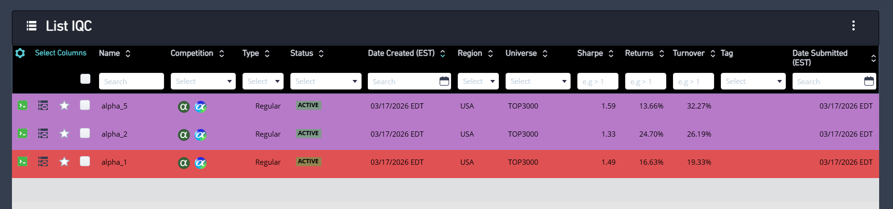

# 🔬 Quantitative Alpha Research (WorldQuant BRAIN)

This folder documents my participation in the **International Quant Championship (IQC)** and research on the WorldQuant BRAIN platform.

## 📊 Performance Metrics
My research focuses on extracting signals from Price-Volume (P-V) and Fundamental data for the USA Top 3000 universe.

| Alpha ID | Sharpe Ratio | Annualized Return | Turnover | Status |
| :--- | :--- | :--- | :--- | :--- |
| Alpha_5 | **1.59** | 13.66% | 32.27% | Active |
| Alpha_1 | **1.49** | 16.63% | 19.33% | Active |
| Alpha_2 | **1.33** | 24.70% | 26.19% | Active |

## 🧪 Research Methodology
I develop alphas using a systematic 4-step process:
1. **Idea Generation:** Identifying market anomalies (e.g., mean reversion in high-volume technology stocks).
2. **Expression Design:** Constructing mathematical signals using the BRAIN operator library.
3. **Neutralization:** Applying industry and market neutrality to isolate pure Alpha.
4. **Validation:** Testing for decay and fitness across different market regimes.

*Note: In accordance with WorldQuant BRAIN IP guidelines, specific mathematical expressions are not disclosed.*

